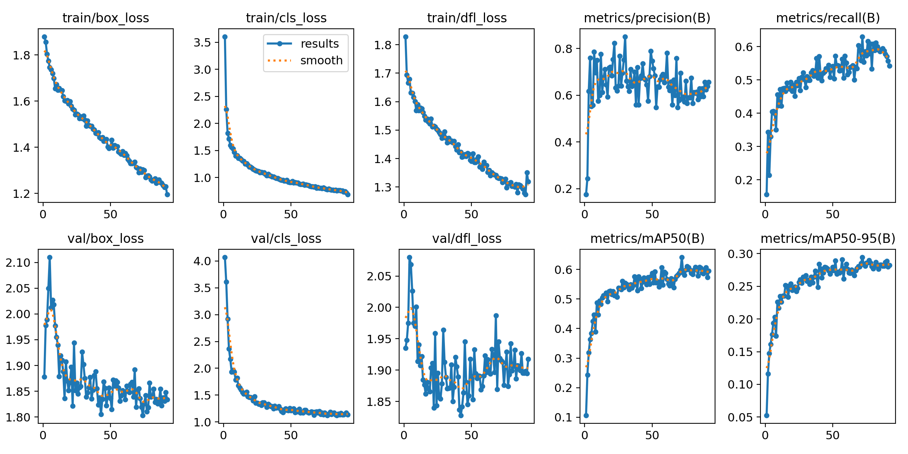
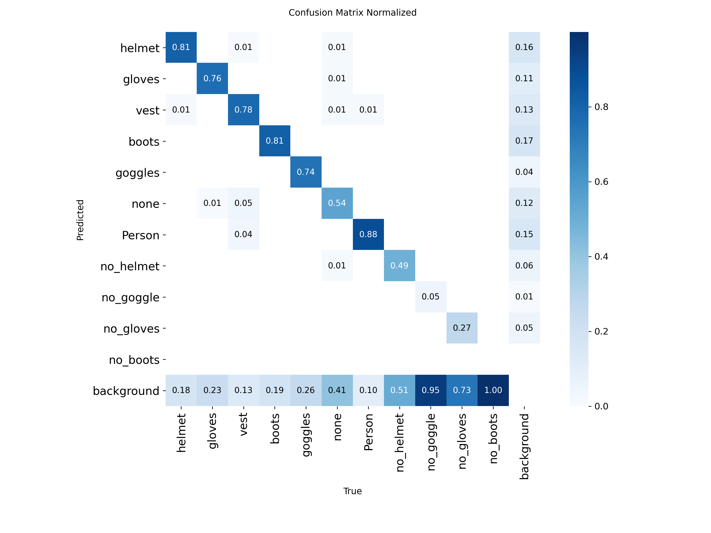

# Realtime-Edge-PPE-Detection
Real-time construction-site PPE compliance monitor on CPU: YOLO11 + ByteTrack, ONNX / OpenVINO / INT8 benchmarked for speed and accuracy (Inference-Optimisation)


**A construction-site safety monitor that runs in real time on a laptop CPU — no GPU, no cloud.** It detects workers and their protective equipment, follows each worker across frames, and logs a violation with a snapshot when someone is seen without a helmet, gloves, goggles or boots.

The focus is **inference optimisation for edge devices**: the model is exported to ONNX and OpenVINO, quantised to INT8, and every format is benchmarked for **both speed and accuracy** on the same hardware.

<!-- Replace with your GIF (Step 9 of the guide) -->


*Video: [title] by [author] on Pexels (Pexels licence).*

---

## Results

### Speed vs accuracy on a laptop CPU (Intel Core i5-8265U, 4 cores, no GPU)

640 × 640 input, 100 test images, 10 warm-up runs excluded, each format in its own process. "Network" = model only; "end-to-end" = read + resize + model + NMS. Accuracy on the held-out **test** split (141 images).

<!-- Replace every value with your own results/benchmark.csv -->
| Format | Precision | Size (MB) | Network (ms) | p50 end-to-end (ms) | p95 (ms) | FPS | mAP50 | mAP50-95 |
|---|---|---|---|---|---|---|---|---|
| PyTorch (baseline) | FP32 | 5.4 | … | … | … | … | … | … |
| ONNX Runtime | FP32 | 10.6 | … | … | … | … | … | … |
| OpenVINO | FP32 | 10.8 | … | … | … | … | … | … |
| OpenVINO | INT8 | 3.4 | … | … | … | … | … | … |

**Takeaway:** *[your finding. In my CPU test run: OpenVINO FP32 ran the network 4× faster than PyTorch (29 vs 120 ms); INT8 was 3× smaller but not faster, because this 8th-gen Intel CPU has no VNNI instructions. Each format was benchmarked in its own process.]*

### Detection accuracy per class (PyTorch FP32, test split)

<!-- From Step 5, Cell 5 of the guide -->
| Class | Test boxes | mAP50 | mAP50-95 |
|---|---|---|---|
| Person | 236 | … | … |
| helmet | 192 | … | … |
| vest | 178 | … | … |
| gloves | 163 | … | … |
| boots | 211 | … | … |
| goggles | 52 | … | … |
| no_helmet | 40 | … | … |
| no_gloves | 58 | … | … |
| no_goggle | 33 | … | … |
| no_boots | 23 | … | … |
| **all** | 1,251 | … | … |

Violation classes are rarer than PPE classes in the data (e.g. 88 `no_boots` training boxes vs 1,251 `boots`), and small far-away heads make `helmet` vs `no_helmet` the main confusion — see the confusion matrix below.

| Training curves | Confusion matrix (normalised) |
|---|---|
|  |  |

---

## How it works

```
 camera / video / RTSP
        │
        ▼
 YOLO11n (OpenVINO)       ──►  ByteTrack  ──►  violation rules  ──►  events.csv + snapshots/
 11 classes: helmet, vest,     stable ID per    no_helmet / no_gloves     one event per track ID,
 gloves, boots, goggles,       object across    no_goggle / no_boots      only after 5 frames
 Person, no_helmet, …          frames                                     (debounce)
        │
        └──►  annotated.mp4  (boxes, FPS, people count, live violations, events logged)
```

| Design choice | Why |
|---|---|
| **YOLO11n** (2.6M params, 6.4 GFLOPs), fine-tuned from COCO | Smallest current YOLO; real-time on CPU |
| **OpenVINO** FP32 and INT8 (post-training quantisation, calibrated on real site images) | Fastest runtime on Intel CPUs; format chosen from the benchmark, not assumed |
| **ByteTrack** tracking | Same worker keeps one ID, so one violation is one event |
| **Debounce** (`--min-frames 5`) | A single wrong frame never raises an alarm |
| **Snapshot per event** | A safety manager verifies an alert in seconds |
| **Benchmark includes NMS and preprocessing** | Measures what the user experiences, not just the network |
| **p95 latency, not only average** | Slow frames cause stutter in live video |

---

## Quick start

Requires [uv](https://docs.astral.sh/uv/). CPU-only PyTorch is configured in `pyproject.toml`.

```powershell
git clone https://github.com/ayindemalik/Realtime-Edge-PPE-Detection.git
cd Realtime-Edge-PPE-Detection
uv sync

uv run edgeppe explore                       # downloads the dataset (178 MB), counts boxes per class
# put your trained weights at models/ppe_yolo11n.pt (training: see below)
uv run edgeppe export                        # ONNX, OpenVINO FP32, OpenVINO INT8
uv run edgeppe benchmark                     # → results/benchmark.csv
uv run edgeppe monitor data/videos/site.mp4 --show     # or: uv run edgeppe monitor 0 --show  (webcam)
uv run edgeppe gif --start 2 --seconds 8     # → assets/demo.gif
```

### Training (Google Colab, T4 GPU, ~1 hour)

```bash
yolo detect train model=yolo11n.pt data=construction-ppe.yaml epochs=100 imgsz=640 batch=32 patience=20
yolo detect val model=runs/detect/train/weights/best.pt data=construction-ppe.yaml split=test
```

### Monitor output

`results/monitor/events.csv`:

```
time,frame,track_id,violation,confidence,snapshot
2026-09-20 10:14:03,57,12,no_helmet,0.71,frame000057_id12_no_helmet.jpg
```

---

## Data

[Construction-PPE](https://docs.ultralytics.com/datasets/detect/construction-ppe/) by Ultralytics — 1,416 real construction-site photos (train 1,142 / val 143 / test 141), 11 classes covering PPE worn and missing. AGPL-3.0. Downloaded automatically; not stored in this repository.

## Project structure

```
├── src/edgeppe/
│   ├── config.py       classes, violation rules, colours
│   ├── explore.py      box counts per class and split
│   ├── export.py       ONNX, OpenVINO FP32, OpenVINO INT8 (PTQ)
│   ├── benchmark.py    size, p50/p95 latency, FPS, test mAP per format
│   ├── monitor.py      video → tracking → debounced violation events
│   └── cli.py          typer CLI: explore, export, benchmark, make-video, monitor, gif
├── results/            benchmark.csv, class_counts.csv
├── assets/             demo GIF, training curves, confusion matrix
└── pyproject.toml      CPU-only PyTorch index, pinned in uv.lock
```

## Limitations

- Violations are box-level; they are not yet linked to a specific worker's `Person` box.
- Rare classes (`no_boots`: 23 test boxes) have noisy scores.
- The dataset is photos from many sites; a real deployment should add a few hundred labelled frames from its own cameras.
- Latency is measured on one laptop CPU; numbers differ on other hardware.
- INT8 calibration used the 143 validation images (Ultralytics recommends 300+).

## Tech stack

Python 3.12 · uv · PyTorch (CPU) · Ultralytics YOLO11 · ByteTrack · ONNX · ONNX Runtime · OpenVINO · NNCF (INT8) · OpenCV · Google Colab (T4) for training

## Author

**Maliki Moustapha** — PhD, Deep Learning & Computer Vision · [GitHub](https://github.com/ayindemalik)

## License

AGPL-3.0, following Ultralytics and the Construction-PPE dataset.

